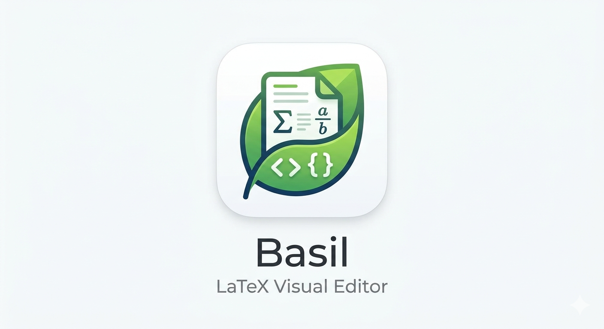
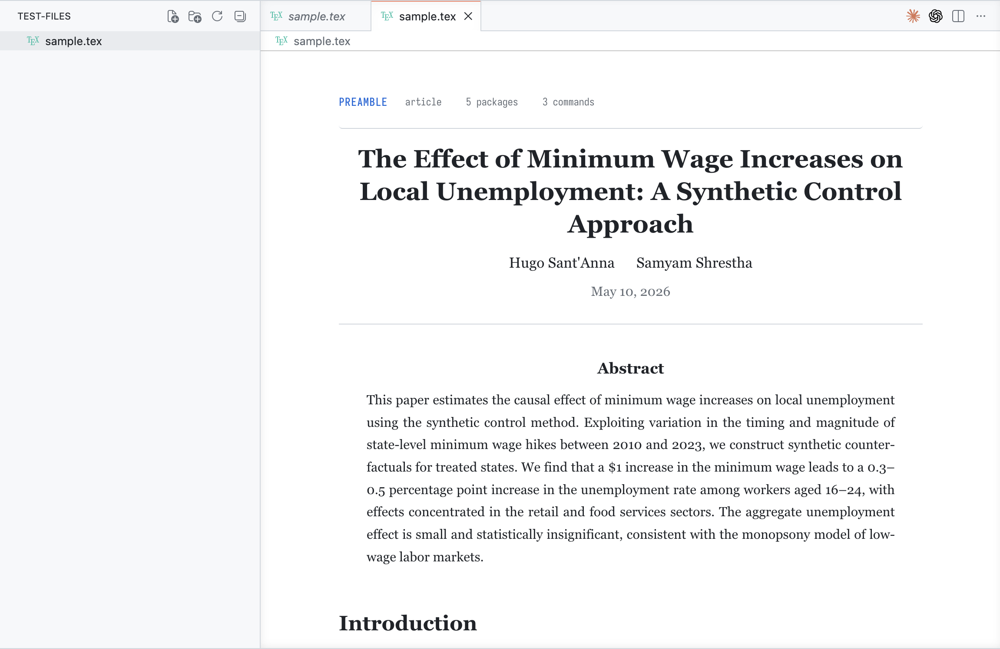
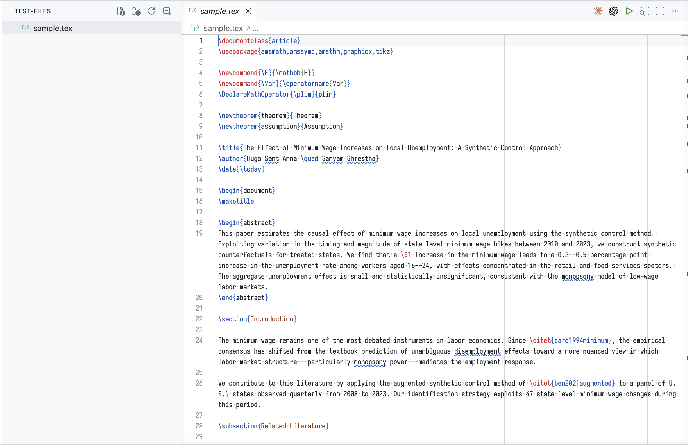

<p align="center">
  
</p>

<h1 align="center">Basil</h1>
<p align="center"><strong>LaTeX Visual Editor for VS Code</strong></p>

<p align="center">
Overleaf-style visual editor that renders your <code>.tex</code> files as rich, readable documents.<br>
Click any block to reveal the raw LaTeX source, edit it directly, click away to re-render.<br>
The entire document is editable: preamble, title, body, math, tables, everything.
</p>

---





## Features

**Visual Editor** — Open any `.tex` file with `Basil: Open Visual Editor` (or right-click tab → Reopen Editor With → LaTeX Visual Editor).

- Sections rendered as headings
- Math rendered with KaTeX (inline and display)
- Tables, lists, theorems, proofs, assumptions rendered
- Figures and TikZ shown as placeholders
- Citations, references, and footnotes styled
- Preamble summary bar (document class, packages, custom commands)

**Click-to-Edit** — Click any rendered block to reveal its LaTeX source in an auto-sizing textarea. Edit the LaTeX. Click outside to commit and re-render. Works for every element: preamble, title, paragraphs, equations, environments, tables, lists.

**LaTeX Autocomplete** — Works in the regular text editor (not just the visual editor):

- `\` triggers command completions (formatting, math, sections, Greek letters, symbols)
- `\begin{` triggers environment completions with snippets
- `\cite{` scans `.bib` files for citation keys
- `\ref{` scans `\label{}` in the document
- `\usepackage{` and `\documentclass{` suggest common packages and classes

**Inline Previews** — In the regular code editor, math blocks show rendered KaTeX decorations and hover previews.

## Installation

### From source

```bash
git clone https://github.com/hugosantanna/basil.git
cd basil
npm install
npm run compile
```

Then in VS Code: press `F5` to launch the Extension Development Host.

### From `.vsix`

```bash
npx vsce package
code --install-extension basil-0.2.0.vsix
```

## Usage

1. Open a `.tex` file in VS Code
2. `Cmd+Shift+P` → `Basil: Open Visual Editor`
3. Click any block to edit its LaTeX source
4. Click outside the block to commit and re-render

## Example

```latex
\documentclass{article}
\usepackage{amsmath,amssymb,amsthm,graphicx,tikz}

\newcommand{\E}{\mathbb{E}}
\newtheorem{theorem}{Theorem}
\newtheorem{assumption}{Assumption}

\title{The Effect of Minimum Wage on Employment}
\author{Jane Doe \quad John Smith}
\date{\today}

\begin{document}
\maketitle

\begin{abstract}
This paper estimates the causal effect of minimum wage increases
on local unemployment using the synthetic control method.
We find that a \$1 increase leads to a 0.3--0.5 percentage point
increase in youth unemployment.
\end{abstract}

\section{Introduction}

The minimum wage remains one of the most debated instruments in
labor economics. Since \cite{card1994minimum}, the empirical
consensus has shifted toward a more nuanced view.

\section{Model}

Firm $j$ faces an upward-sloping labor supply:
$$L_j^s(w) = \alpha_j + \beta_j w + \varepsilon_j.$$

The profit maximization problem is:
\begin{equation}
  \max_{L_j} \; f(L_j) - w(L_j) \cdot L_j.
  \label{eq:profit}
\end{equation}

The first-order condition yields:
\begin{align}
  f'(L_j^*) &= w(L_j^*) \left(1 + \frac{1}{\eta_j}\right) \\
  &= w(L_j^*) + \frac{w(L_j^*)}{\eta_j},
\end{align}
where $\eta_j$ is the firm-level labor supply elasticity.

\begin{assumption}
The labor supply elasticity $\eta_j > 0$ is finite for all firms.
\end{assumption}

\begin{theorem}
Under Assumption~1, a binding minimum wage
$\bar{w} \in (w^*, w^m)$ increases employment.
\end{theorem}

\section{Data}

\begin{table}[htbp]
\centering
\caption{Summary Statistics}
\label{tab:summary}
\begin{tabular}{lccc}
\hline
Variable & Treated & Control & Difference \\
\hline
Unemployment (\%) & 5.8 & 5.2 & 0.6 \\
Youth unemp. (\%) & 14.3 & 12.1 & 2.2 \\
Min. wage (\$)     & 10.50 & 7.25 & 3.25 \\
\hline
\end{tabular}
\end{table}

\section{Results}

\begin{enumerate}
  \item Aggregate unemployment effect is small and insignificant.
  \item Youth unemployment increases by 0.4 p.p.\ (significant at 5\%).
  \item Effects concentrated in retail and food services.
\end{enumerate}

\begin{tikzpicture}[scale=1.0]
  \draw[->] (-0.5,0) -- (8,0) node[right] {Quarters};
  \draw[->] (0,-1.5) -- (0,2) node[above] {$\hat{\tau}_t$};
  \draw[dashed,gray] (4,-1.5) -- (4,2);
  \draw[thick,blue] plot coordinates
    {(0,0.05) (1,-0.02) (2,0.08) (3,-0.05)
     (4,-0.1) (5,-0.35) (6,-0.42) (7,-0.38)};
\end{tikzpicture}

\section{Conclusion}

Moderate minimum wage increases have limited aggregate
disemployment effects but measurable impacts on youth
employment.\footnote{See Online Appendix for details.}

\end{document}
```

## License

MIT
